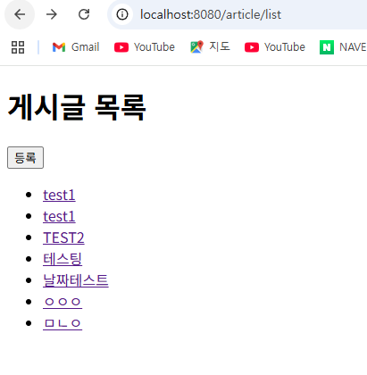
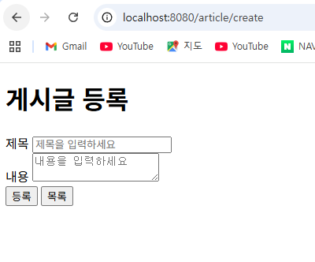
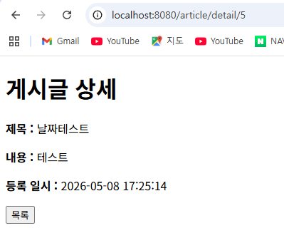

## 1차 요구사항 구현
- [o] 유저가 루트 url로 접속시에 게시글 리스트 페이지(http://주소:포트/article/list)가 나온다.
- [o] 리스트 페이지에서는 등록 버튼이 있고 버튼을 누르면 http://주소:포트/article/create 경로로 이동하고 등록 폼이 나온다.
- [o] 게시글 등록을 하면 http://주소:포트/article/create로 POST 요청을 보내어 DB에 해당 내용을 저장한다.
- [o] 게시글 등록이 되면 해당 게시글 리스트 페이지로 리다이렉트 된다. 페이지 URL 은 http://주소:포트/article/list 이다.
- [o] 리스트 페이지에서 해당 게시글을 클릭하면 상세페이지로 이동한다. 해당 경로는 http://주소:포트/article/detail/{id} 가 된다.
- [o] 게시글 상세 페이지에는 id에 맞는 게시글 데이터와 목록 버튼이 있다. 목록 버튼을 누르면 게시글 리스트 페이지로 이동하게 된다.

- (추가 기능이나 구현기능설명이 필요한 경우 서술)

## 미비사항 or 막힌 부분
- 게시글 등록 폼 구현 시 `<form>` 태그의 `action`과 `method` 속성을 올바르게 설정하는 부분에서 어려움이 있었습니다.
- GET과 POST 요청의 차이를 이해하고, 등록 폼에서는 `method="post"`를 사용해야 DB에 데이터가 저장된다는 것을 파악하는 데 시간이 걸렸습니다.

## UI/UX (화면 캡처본을 복사 붙여 넣기, url 주소 나오도록)
- 게시글 리스트 페이지
-
- 게시글 등록 폼 페이지
- 
- 게시글 상세 페이지
- 

## MVC 패턴
- 이번 프로젝트에서 MVC 패턴을 적용했습니다. 
ArticleController는 사용자의 요청을 받아 적절한 응답을 반환하는 Controller 역할을 담당하고, Article은 DB 테이블과 매핑되는 Model 역할을 담당합니다. list.html, create.html, detail.html은 사용자에게 화면을 보여주는 View 역할을 담당합니다. Controller는 요청/응답만 처리하고 비즈니스 로직은 ArticleService에 위임함으로써 역할을 명확하게 분리했습니다.

## 스프링에서 의존성 주입(DI) 방법 3가지 방법
- ...

## JPA의 장점과 단점
- ...

## HTTP GET 요청과 POST 요청의 차이
- GET 요청
  데이터를 조회할 때 사용합니다. 이번 프로젝트에서 게시글 리스트 페이지(/article/list)나 상세 페이지(/article/detail/{id})에 접근할 때 사용했습니다.
- POST 요청
데이터를 생성하거나 변경할 때 사용합니다. 이번 프로젝트에서 게시글 등록(/article/create) 시 사용했습니다.
